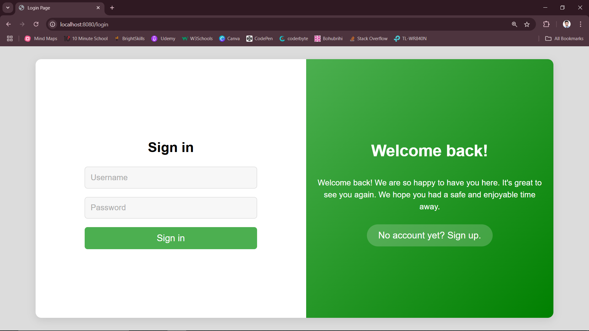

# AuthValidator

AuthValidator is a Java Spring Boot project designed to provide a seamless and secure authentication experience. The application includes a **Login Form** and a **Sign-Up Form** with built-in validation rules for username, mobile number, email, and password fields. Users must enter valid data to log in or sign up successfully. Invalid entries return specific error messages to guide users.

## Features

- **User-Friendly Interfaces:**
  - A modern and clean design for the Login, Sign-Up, and Confirmation pages.
  - Responsive layout for improved usability.
- **Validation Rules:**
  - **Username:** Must meet specific criteria.
  - **Mobile Number:** Only valid numbers with optional `+` sign.
  - **Email:** Proper email format validation.
  - **Password:** Must adhere to the defined security standards.
  - ---
- **Endpoints:**
  - `/signup`: Displays the sign-up form.
  - `/login`: Displays the login form.
  - `/processForm`: Processes the form submission and validates user data.
- **Error Handling:** Specific error messages for invalid input. 
---
---

### Login Page
`GET` URI: `localhost:8080/login`

<br />

### Sign-Up Page
`GET` URI: `localhost:8080/signup`


### Confirmation Page
`POST` URI: `localhost:8080/processForm`


## Installation

### Prerequisites
- Java 17 or higher
- Maven 3.8+
- Spring Boot 3+
- A web browser

### Steps
1. Clone the repository:
   ```bash
   git clone https://github.com/yourusername/AuthValidator.git
   ```
2. Navigate to the project directory:
   ```bash
   cd AuthValidator
   ```
3. Build the project using Maven:
   ```bash
   mvn clean install
   ```
4. Run the application:
   ```bash
   mvn spring-boot:run
   ```
5. Access the application at [http://localhost:8080](http://localhost:8080).

## Usage

1. Navigate to the `/login` endpoint to access the login form.
2. Navigate to the `/signup` endpoint to access the sign-up form.
3. Enter valid data into the fields to log in or sign up successfully.
4. On successful form submission, you will see the confirmation page.

## Technologies Used

- **Backend:** Java Spring Boot
- **Frontend:** HTML, CSS
- **Validation:** Spring Boot Starter Validation (Hibernate Validator)

## License
This project is licensed under the [MIT License](LICENSE).

## Contact
For any inquiries or feedback, please contact:
- **Name:** Shahariyr Reza
- **Email:** shahariyr.reza@hotmail.com
- **GitHub:** [Shahariyr Reza](https://github.com/ShahariyrReza)

 
